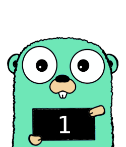

<div align="center"></div>

# Suspect

[Supabase](https://supabase.com) integration testing toolset

## Features
 
- Run tests against [local dev environment](https://supabase.com/docs/guides/local-development)
- Access the API, database and email communication using preconfigured instances of
  - [httpexpect](https://github.com/gavv/httpexpect)
  - [pgx](https://github.com/jackc/pgx)
  - [inbucket](https://github.com/inbucket/inbucket)

## Requirements

You need to have [Supabase CLI](https://github.com/supabase/cli) installed and [configured](https://supabase.com/docs/guides/local-development) for your project.

## Usage

```go
func Test(t *testing.T) {
    suspect.NewSuspect(t).
        Db(func(db *pgx.Conn) {
            // prepare data
        }).
        Api(func(api *httpexpect.Expect) *httpexpect.Expect {
            // call endpoint
            return api
        }).
        Mail(func(mail *client.Client) {
            // check emails
        })
}
```


See [example](./example)

## Credits

Gopher mascot is based on original artwork by Renee French.
